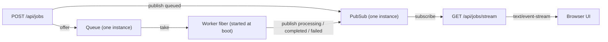

# next-effect

A small job-pipeline demo built on **[Next.js](https://nextjs.org) 16** and **[Effect](https://effect.website) 4**. You enqueue jobs over HTTP, a background worker processes them, and status changes stream back to the browser live over Server-Sent Events.

## Getting Started

```bash
npm run dev
```

Open [http://localhost:3000](http://localhost:3000) and create a job. Watch it move through `queued → processing → completed | failed` in real time.

## How it works

Effect programs are just *descriptions* of work — they don't run until something executes them. That "something" is a **Runtime**: a long-lived container holding your live services. Because Next.js owns the entry point and re-runs your code on every request, the runtime is built **once** and shared across every request and background fiber.

### The shared runtime

[`lib/runtime.ts`](lib/runtime.ts) builds the runtime a single time and pins it to `globalThis` so hot-reload doesn't duplicate it:

```ts
const AppLayer = workerLayer.pipe(
  Layer.provideMerge(Layer.mergeAll(pubsubLayer, queueLayer)),
);
export const runtime = (g.__jobRuntime ??= ManagedRuntime.make(AppLayer));
```

Building it constructs exactly **one** of each service — one `Queue`, one `PubSub`, and one background worker fiber — all living in the runtime's Context. Every request handler runs its Effect through this same `runtime`, so they all share those instances. That shared state is the entire reason the pipeline works.

### Services

| Service | File | Role |
|---|---|---|
| `JobQueue` | [`service/JobQueue.ts`](service/JobQueue.ts) | Unbounded queue. Holds jobs waiting to be processed. |
| `JobPubSub` | [`service/JobPubSub.ts`](service/JobPubSub.ts) | Broadcast bus. Every status change is published here; the SSE route subscribes. |
| `JobWorker` | [`service/JobWorker.ts`](service/JobWorker.ts) | Background fiber started at boot. Loops forever: take a job, publish `processing`, simulate work, publish the result. |

### Routes

| Route | File | Role |
|---|---|---|
| `POST /api/jobs` | [`app/api/jobs/route.ts`](app/api/jobs/route.ts) | Create a job: publish `queued`, then offer it to the queue. |
| `GET /api/jobs/stream` | [`app/api/jobs/stream/route.ts`](app/api/jobs/stream/route.ts) | Subscribe to the PubSub and stream every job update to the browser as SSE. |

### End-to-end flow



Three independent execution contexts — a `POST` handler, a `GET` handler, and a startup-spawned worker fiber — all rendezvous on the **same** Queue and PubSub. They never call each other directly; the shared runtime is what connects them.

> **Why `Stream.unwrap` in the stream route?** `pubsub.subscribe()` requires a `Scope` so the subscription is released when the connection closes. In Effect 4, `Stream.unwrap` provides that scope itself and binds the cleanup to the stream's lifetime (its signature excludes `Scope` from the result's requirements), so the subscription is released per client with no leak.

## Project notes

- This is **not** stock Next.js — see [`AGENTS.md`](AGENTS.md). Conventions may differ from upstream; consult `node_modules/next/dist/docs/` before changing framework-level code.
- The job model and status enum live in [`types/index.ts`](types/index.ts), defined with Effect `Schema`.
